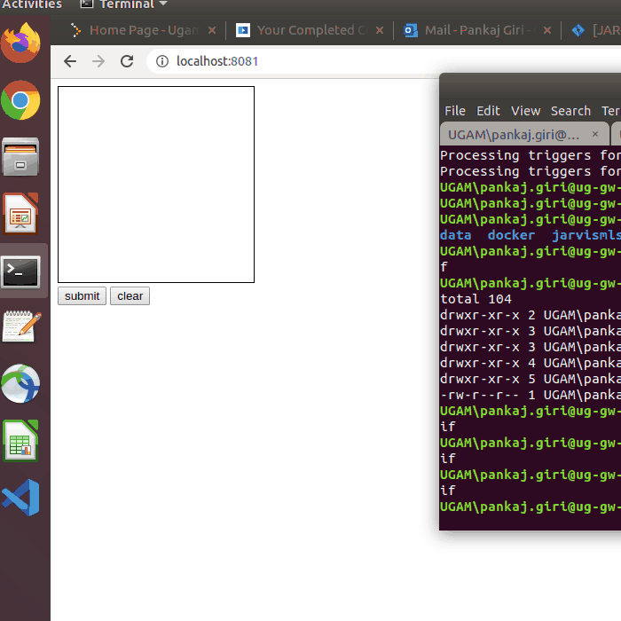

# Project Title/Description
This project offers a web interface to the MNIST digit recognition model which is tensorflow based.
Follow the steps to fire it up and enjoy..


## Getting Started
Shows a sample implementation of how to expose a tensorflow model through a flask api and how to turn MNIST digit recognition into something fun by providing a html5 based web front-end.


### Prerequisites/Dependencies
Create the conda environment with python version > 3.0
```
conda create --name <env_name> python=3.5
pip install keras
pip install tensorflow
pip install flask_cors
```
You will also need node installed.
Node dependencies -
```
npm install connect serve-static
```
## Firing it up
Starting the backend

```
./startMNISTDemo.sh
```
This starts up a flask app and listens in port 8080.
You will have to replace ```keras_new``` with your own environment name


Starting the frontend
```
cd webmnist-frontend; node serve.js 
```

3) Open up a browser and type "http://localhost:8181"
This shows up an html canvas. Draw your digit there and press submit to get the prediction out.




## Author

* **Pankaj Giri**

